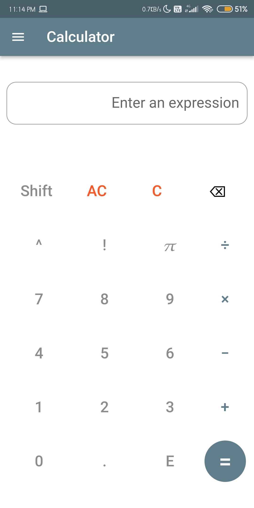
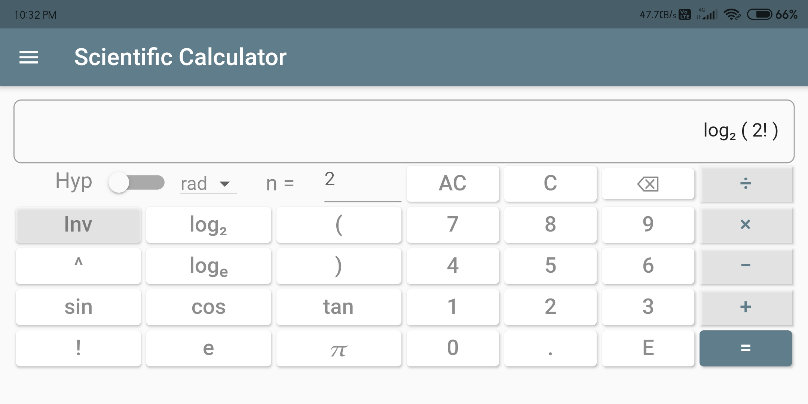
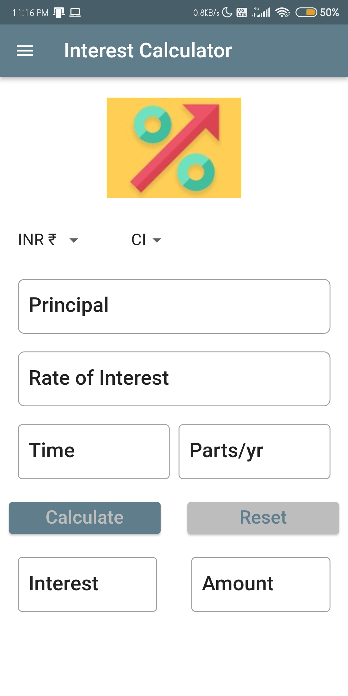
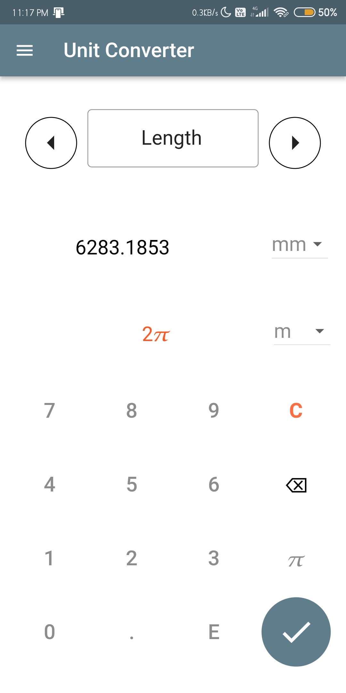
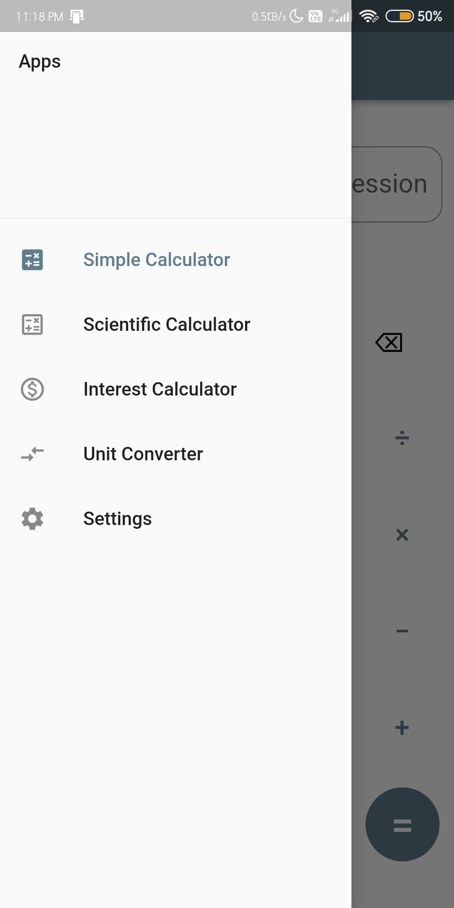

# Calculator App

Android, iOS and Desktop Calculator.

## Simple Calculator

Calculator containing basic arithmetic functionalities (+, -, *, /, ^, !).

## Scientific Calculator

Calculator with:

1. arithmetic functionalities (^, +, -, *, /, !) with paranthesis

2. Logarithms and antilogarithms

3. Trigonometric functions and their inverse (both degrees and radians)

4. Hyperbolic functions and their inverse

5. Math constants 'e' and &#960;

_**Note:**_
Values greater than 1E+15 are rounded off to 2^63. This issue will be addressed in the future.

## Interest Calculator

Basic Simple Interest and Compound Interest calculator

## Unit Coverter
Conversion of following Physical quatities:
1. Mass
2. Length
3. Temperature
4. Volume
5. Force
6. Pressure
7. Velocity

## App Drawer

