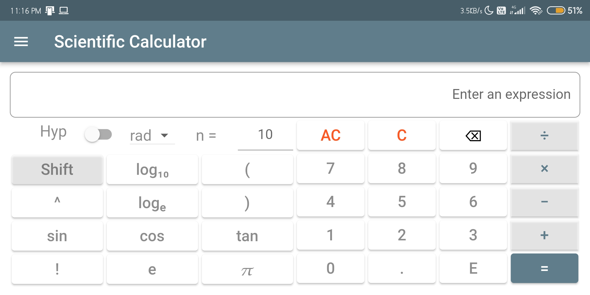

# Calculator App

Android, iOS and Desktop Calculator.

## Simple Calculator

Calculator containing basic arithmetic functionalities (+, -, *, /).

## Scientific Calculator

Calculator with:

1. arithmetic functionalities (^, +, -, *, /, !) with paranthesis

2. Logarithms and antilogarithms

3. Trigonometric functions and their inverse (both degrees and radians)

4. Hyperbolic functions and their inverse

5. Math constants 'e' and &#960;

## Interest Calculator

Basic Simple Interest and Compound Interest calculator

## Unit Coverter

Currently under Construction

## App Drawer

